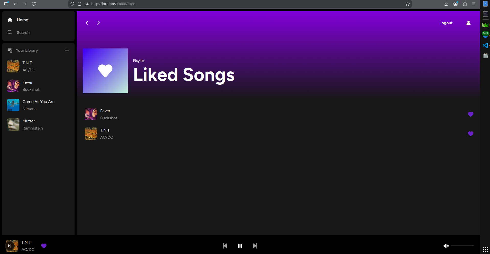

# Musong 🎵

Musong is a **Spotify clone** built with **Next.js 16**. The app lets you listen to music, manage playlists, and interact with your favorite tracks in a clean and modern interface.

---

## 📝 Description

Musong is a modern web music streaming application inspired by Spotify.  
Main features include:

- Search and play songs
- Like and save favorite tracks
- Responsive player
- Modern UI with Tailwind CSS
- Supabase for authentication and database



---

## ⚡ Technologies

- **Next.js 16** – React framework for server-side rendering and routing
- **TypeScript** – Strongly typed JavaScript
- **Supabase** – Authentication and database
- **Tailwind CSS** – Utility-first CSS framework
- **Zustand** – State management
- **React Hot Toast** – Notifications
- **Use Sound** – Audio player hooks

---

## 🚀 Installation

Clone the repository:

```bash
git clone https://github.com/your-username/musong.git
cd musong/app
npm install
npm run dev
